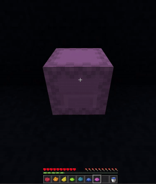
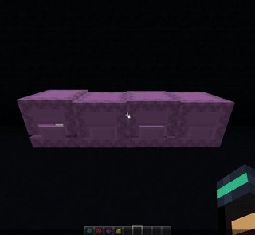

# Dyeable Shulkers

---

Dyeable Shulkers is a **server-side** mod, clients don't need to install it.

## Shulker Boxes

You can dye shulker boxes directly on ground without breaking them...

...and even rename it !

## Shulker Entities

You can also dye shulkers.

---

Since **version 1.1.0**, you can enable and disable some functionalities with the `/dyeable-shulkers` command or by editing the `dyeable-shulkers.properties` file in the `config` folder.